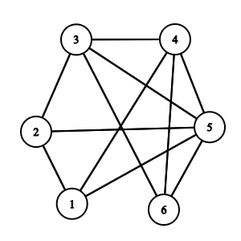
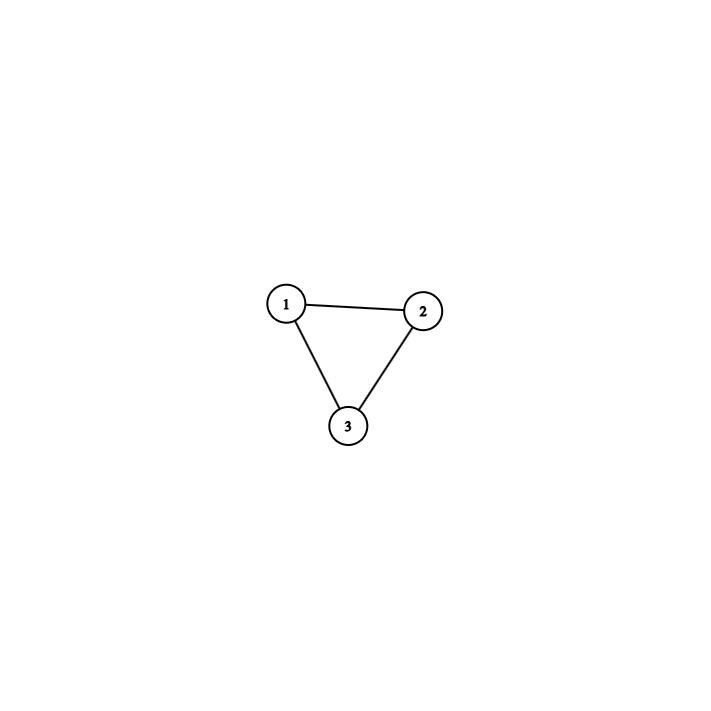

# Maximum Clique

# Dokumentace

## Popis problému:

Maximum clique (maximální klika) v grafu je problém, který řeší maximální možný počet vrcholů, takových že 
každé dva různé vrcholy z kliky jsou spojeny hranou.

Vstupní formát je

*x*: *y*, *z*
...

Kde *x* je číslo vrcholu v grafu, od 1 a *y*, *z* jsou vrcholy, ke kterým je vrchol *x* spojen hranou.

Ukázka správného vstupu:

```
1: 2, 4, 5
2: 1, 3, 5
3: 2, 4, 5, 6
4: 3, 5, 1, 6
5: 4, 6, 1, 2, 3
6: 5, 4, 3
```
což odpovídá grafu na obrázku níže:



## Zakódování

Pro zakódování instance grafu do proměnných používáme proměnné x<sub>i, v</sub>, což značí, že vrchol `v` je na pozici `i` v klice.

Dále používáme následující podmínky:
1) Existuje i-tý vrchol v klice: $var(i, v)$, kde vrchol $v$ je na $i-té$ pozici v klice, pro každé $ 1 \le i \le k$ a každý vrchol
2) i-tý a j-tý vrcholy jsou různé $\neg var(i, v)  \vee \neg var(j, v) $, pro každou kombinaci $ 1 \le i, j \le k$ a každý vrchol
3) Každé dva vrcholy v klice jsou propojeny hranou $-var(i, v) \vee -var(j, u)$ pro každý $v, u \in V$ a každou kombinaci $1 \le i, j \le k$


## Uživatelská dokumentace


Použití: 
```
maximum_clique.py [-h] [-i INPUT] [-o OUTPUT] [-v {0,1}]
```

Command-line options:

* `-i INPUT`, `--input INPUT` : Soubor s instancí grafu. Výchozí: "instances/graph_1.in".
* `-o OUTPUT`, `--output OUTPUT` : Výstupní soubor pro CNF formule v DIMACS formátu.
*  `-v {0,1}`, `--verb {0,1}` :  Verbosity SAT solveru.

## Instance grafů:

* `graph_1.in`: Graf o 3 vrcholech s klikou velikosti 3.

* `graph_2.in`: Větší graf o 6 vrcholech, s maximální klikou velikosti 4. (převzato z https://cs.stanford.edu/people/eroberts/courses/soco/projects/2003-04/dna-computing/clique.htm)

* `graph_3.in`: Kompletní graf o 200 vrcholech - zabralo cca 27s
* `graph_4.in`: Kompletní graf o 100 vrcholech - zabralo cca 2s
